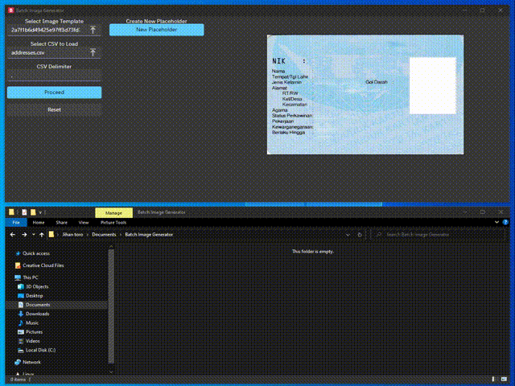

# Batch Image Generator

Generate dynamic image content based on a template image and a CSV file.

- [x] Generate images from a template image and a CSV file
- [x] Basic CSV Support
- [x] Custom Font
- [x] Transform to uppercase, QR Code, Avatar, Initial Avatar
- [x] Text Alignment
- [x] Text Color
- [ ] File for Save/Load
- [ ] More control of rectangle position
- [ ] More Interactive Progress

## Development

Please visit [Wails Getting Started](https://wails.io/docs/gettingstarted/installation) to setup the development environment.

Made with [Wails](https://wails.app/) and [Svelte](https://svelte.dev/).
